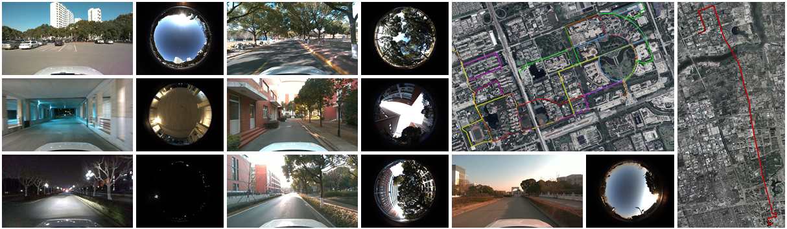

# SensNav Dataset

 The Chinese version of the README is available [here](README_CN.md).

The SensNav dataset contains six data sequences: five campus scenes and one urban scene. The urban scene spans 18.6 kilometers, including a 5.2-kilometer tunnel segment. The campus dataset features open-sky areas, tree-lined boulevards, and building-occluded regions.

The sensor suite comprises: a forward-looking RGB camera, a sky-view fisheye camera, three inertial measurement units (IMUs), two GNSS receivers, and a high-precision GNSS/INS integrated navigation system (providing ground truth trajectory).

 

  

## 1 Description of the Dataset

### 1.1 Introduction to the Data Acquisition Platform

The SensNav dataset was collected using a custom-developed multi-sensor platform comprising an aluminum alloy structural frame, to which sensors were rigidly attached via screws or adhesive. The frame was mounted on the roof of a Volkswagen Tiguan L using a commercial luggage rack system. The following figure illustrates the data acquisition platform configuration and vehicle mounting setup.

  

The data acquisition platform employs a three-layered architecture:
1) Bottom layer: Two IMUs, two GNSS antennas, a high-precision GNSS/INS integrated navigation system (ground truth), and a GNSS receiver.
2) Middle layer: One IMU, a GNSS-disciplined oscillator (GNSSDO), and a forward-looking RGB camera.
3) Top layer: A sky-view fisheye camera.

The coordinate system origin is defined at the center of the ground truth system's IMU. All other sensors are spatially aligned with the X-Y-Z axes of this origin. The following figure presents the CAD model details, including critical dimensional parameters and sensor coordinate system specifications.

  

In the above figure, only the top view of the bottom layer and a side view encompassing all layers are provided. This is because the geometric center of IMU 2 in the middle layer is vertically aligned with the ground truth system's IMU center, with only the Z-axis coordinates differing. In the side view, IMU 1's marker is omitted because it overlaps with the ground truth system's X-axis and would obscure the ground truth. Additionally, non-essential mounting holes have been removed to enhance clarity and visual simplicity.

### 1.2 Sensors Setup
The corresponding data acquisition platform of SensNav integrates an RGB camera, a fisheye camera, three IMUs, two GNSS receivers and a high-precision combined GNSS/INS navigation system (ground truth). The table below lists the specifications and some of the parameters of these sensors:

|                                                                                                     Sensor                                                                                                    |                Type                |                                                              Key parameters                                                             | Frequency in ROS |
|:-------------------------------------------------------------------------------------------------------------------------------------------------------------------------------------------------------------:|:----------------------------------:|:---------------------------------------------------------------------------------------------------------------------------------------:|:----------------:|
|                                                                                             Forward-facing Camera                                                                                             | Intel RealSense Depth Camera D455f |                           RGB, 1280 x 720 H-FOV:90&deg;, V-FOV:65&deg;, D-FOV:98&deg;                          |       30 Hz      |
|                                                                                                Fish-eye Camera                                                                                                |       Hikrobot  MV-CS050-10UC      | RGB: 2448 x 2048 Sensor: 2/3'' Sony IMX264 CMOS Lens: Fujifilm FE185C057HA-1,1.8mm, H-FOV:185&deg;, V-FOV:185&deg; |       10 Hz      |
|                                                                                             GNSS receiver 1 (RTK)                                                                                             |   Septentrio OEM  AsteRx-m3 Pro+   |                                             GPS, GLONASS, BeiDou, Galileo, QZSS, NavIC, SBAS                                            |       20 Hz      |
|                                                                                                GNSS receiver 2                                                                                                |           u-blox ZED-F9P           |                                                   GPS, GLONASS, Galileo, BeiDou, QZSS                                                   |       10 Hz      |
|                                                                                         Ground Truth  GNSS/INS System                                                                                         |           CHCNAV CGI-830           |          BeiDou, GPS, GLONASS, Galileo, QZSS RTK Positioning Accuracy (RMS): 1 cm + 1 ppm (Horizontal), 2 cm + 1 ppm (Altitude)         |         -        |
|                                                                                                     IMU 1                                                                                                     |            WHEELTEC N100           |                                   Bias instability (Allan):  10&deg; /h (Gyro), 0.4 mg (Accel).                                   |      100 Hz      |
|                                                                                                     IMU 2                                                                                                     |            Xsens MTi 680           |                                    Bias instability (Allan): 8&deg; /h (Gyro), 0.01 mg (Accel).                                   |      200 Hz      |
|                                                                                                     IMU 3                                                                                                     |           HiPNUC  HI14R5N          |                                  Bias instability (Allan): 1.76&deg; /h (Gyro), 0.021 mg (Accel).                                 |      250 Hz      |

Note: FOV denotes field of view, with H-FOV, V-FOV, and D-FOV representing horizontal, vertical, and diagonal fields of view, respectively. Gyro and Accel are abbreviations for gyroscope and accelerometer.

**Notes:**

**1) GNSS Receiver.** GNSS receiver 1 and the ground truth are connected to RTK, whereas GNSS receiver 2 is not. The three GNSS devices share a main antenna via a power splitter. Furthermore, GNSS receiver 1 and the ground truth are connected to an auxiliary antenna through another power splitter to facilitate positioning and orientation.

**2) IMU.** The X-axis (forward) of IMU 2 and IMU 3 is aligned with the center of the bottom board, coinciding with the Y-axis (forward) of the ground truth. In contrast, IMU 1 is installed on one side of the bottom board and aligned with the X-axis (right) of the ground truth. For detailed dimensions, please refer to the CAD drawing.

**3) Ground Truth.** Ground truth is provided by a high-end MEMS integrated navigation receiver, the CGI-830, from Shanghai Huace Navigation Technology Co., Ltd. (CHCNAV). The CGI-830 features a full-frequency GNSS module and a 6-axis high-performance MEMS IMU, and it supports tightly coupled post-processing using NovAtel's Inertial Explorer software. According to the official website [TECHNICAL PARAMETER](https://obs-web.huace.cn/CHC%C2%AE+CGI-830%E5%8E%98%E7%B1%B3%E7%BA%A7%E7%BB%84%E5%90%88%E5%AF%BC%E8%88%AA%E7%B3%BB%E7%BB%9F%E7%94%A8%E6%88%B7%E6%89%8B%E5%86%8C-V2.2.3-20250110.pdf), the positioning performance (RMS) in RTK mode is 0.01 meters horizontally and 0.02 meters vertically. Additionally, when GNSS is interrupted for 60 seconds, the post-processed positioning accuracy (RMS) can still reach 0.1 meters horizontally and 0.05 meters vertically.

### 1.3 Synchronization
To ensure temporal consistency, sensor data is collected using ROS. A GNSSDO with NTP synchronization is connected to the main GNSS antenna and to the data collection host via a network cable. Consequently, the system time of the data collection host is synchronized with UTC, resulting in a rough alignment between ROS time and UTC. Both GNSS receivers include GPS week-second timestamps in their respective ROS topics, which can be used to determine the offset between the ROS timestamp and GPS time.

### 1.4 Calibration
For IMU calibration, three hours of data were collected under static conditions, and the noise parameters of the gyroscope and accelerometer were estimated using the open-source toolbox *imu_utils* ([link](https://github.com/gaowenliang/imu_utils)).

The camera calibration is performed using the *Kalibr* toolbox ([link](https://github.com/ethz-asl/kalibr)) to estimate the intrinsic parameters of both cameras. The RGB camera is calibrated using the *pinhole-radtan* model, while the fisheye camera is calibrated using the *omni-radtan* model.

After calibrating each IMU and camera individually, the RGB camera and the three IMUs were jointly calibrated using the previously estimated IMU parameters. The *Kalibr* toolbox ([link](https://github.com/ethz-asl/kalibr)) was also employed to obtain the extrinsic parameter matrix between the RGB camera and the three IMUs.

## 2 Data Sequence Overview and Download

### 2.1 Data Sequence Information Summary
|     **Sequence**    | **File size** |     **UTC time**    |     **Duration**    | **Path length** |                                             **sensors**                                             |       **description**      |
|:-------------------:|:------------:|:------------------:|:---------------:|:------------:|:--------------------------------------------------------------------------------------------------:|:-------------------:|
| 2025-01-15-14-25-49 |     10.9 GB     | 06:25:49- 06:44:27 | 1118s (18m:38s) |   5401.6 m   | IMU1, IMU2, IMU3, GNSS Receiver 1(RTK), GNSS Receiver 2, RGB camera, Fish-eye camera, Ground Truth |      Campus/Afternoon      |
| 2025-01-15-15-00-35 |     7.6 GB     | 07:00:35- 07:15:05 |  870s (14m:30s) |   3869.94 m  | IMU1, IMU2, IMU3, GNSS Receiver 1(RTK), GNSS Receiver 2, RGB camera, Fish-eye camera, Ground Truth |      Campus/Afternoon      |
| 2025-01-15-17-01-24 |     569.1 MB     | 09:01:24- 09:39:06 | 2261s (37m:41s) |   18.62 km   |                   IMU1, IMU2, GNSS Receiver 1(RTK), GNSS Receiver 2, Ground Truth                  | Urban (including tunnel)/Evening |
| 2025-01-15-19-17-15 |     5.6 GB     | 11:17:15- 11:33:57 | 1001s (16m:41s) |   4683.97 m  | IMU1, IMU2, IMU3, GNSS Receiver 1(RTK), GNSS Receiver 2, RGB camera, Fish-eye camera, Ground Truth |      Campus/Night      |
| 2025-01-17-15-54-34 |     8.3 GB     |  07:54:34-08:08:58 |  863s (14m:23s) |   3865.18 m  | IMU1, IMU2, IMU3, GNSS Receiver 1(RTK), GNSS Receiver 2, RGB camera, Fish-eye camera, Ground Truth |      Campus/Afternoon      |
| 2025-01-17-18-00-01 |     6.0 GB     |  10:00:01-10:18:24 | 1103s (18m:23s) |   5516.12 m  | IMU1, IMU2, IMU3, GNSS Receiver 1(RTK), GNSS Receiver 2, RGB camera, Fish-eye camera, Ground Truth |      Campus/Night      |

### 2.2 download
**Link:**
- 2025-01-15-14-25-49: [quark](https://pan.quark.cn/s/c0e41bd1a872),[OneDrive link coming soon.]

- 2025-01-15-15-00-35: [quark](https://pan.quark.cn/s/b6e0f280884b),[OneDrive link coming soon.]

- 2025-01-15-17-01-24: [quark](https://pan.quark.cn/s/71eed047fd05),[OneDrive link coming soon.]

- 2025-01-15-19-17-15: [quark](https://pan.quark.cn/s/dedab2e5185b),[OneDrive link coming soon.]

- 2025-01-17-15-54-34: [quark](https://pan.quark.cn/s/e5f199ce7355),[OneDrive link coming soon.]

- 2025-01-17-18-00-01: [quark](https://pan.quark.cn/s/36aeeb101daf),[OneDrive link coming soon.]

## 3 File Description
### 3.1 File Structure and Description
数据集中的文件结构如下图所示：

  

**1)** The `.bag` files with the "ROS" identifier in their names contain data collected under ROS, including information from IMUs, cameras, and GNSS receivers. The specific topic names are illustrated in the figure above, where the blue background represents IMU-related topics, the yellow background corresponds to camera-related topics, and the green background represents GNSS receiver-related topics. In addition, the topic */INTELcam/imu* refers to data from the built-in IMU of the INTEL camera, which is also included in the dataset. 
**Note**: The bag files in the urban sequence data folder "2025-01-15-17-01-24" do not include any topics related to the camera and IMU 1.

**2)** The `.sbf` and `.25O` files with the "GNSS1" identifier in their names are raw data files recorded by GNSS receiver 1. These files correspond to two different formats: binary SBF (Septentrio Binary Format) and RINEX format. The RINEX files are generated using Septentrio’s official "SBF Converter" software. If other formats are required, users can download the **RxTools** software from the [Septentrio official website](https://www.septentrio.com/en/products/gps-gnss-receiver-software/rxtools#resources), which includes the "SBF Converter", to convert `.sbf` files as needed.

**3)** The `.25O` file with the "Correction" identifier in its name contains RTK base station data stored in the RINEX format. The time span of the RINEX file matches the duration during which the data was recorded in ROS.

**4)** The `.txt` files with the "GT" identifier in their names contain the results of tightly coupled post-processing using NovAtel's Inertial Explorer software and serve as ground truth. The numeric suffix after the filename (1Hz, 10Hz, 20Hz) indicates the data sampling rate, with multiple rates provided to accommodate different application requirements. To facilitate the visualization of ground truth trajectories, an additional KML file of the **1Hz ground truth version** is included in the "GT-1Hz-KML" folder.

**5)** The calibration result files for the IMU and camera are stored in a separate "Calibration" folder. Additionally, the lever arm values between the three IMUs and the ground truth relative to the GNSS main antenna are provided in the "Lever Arms.txt" file.

**6)** For the message formats of the topics corresponding to the two GNSS receivers, please refer to the following resources: ublox ROS driver ([ublox ROS driver](https://github.com/KumarRobotics/ublox)), ublox message format ([ublox message](https://docs.ros.org/en/kinetic/api/ublox_msgs/html/index-msg.html)), and Septentrio ROS driver ([Septentrio ROS driver](https://github.com/septentrio-gnss/septentrio_gnss_driver)).

### 3.2 Ground Truth Trajectory Display (Visualized in Google Earth)
Below is the ground truth trajectory of all data series, visualized in Google Earth using the KML file from the "GT-1Hz-KML" folder.

- **2025-01-15-14-25-49:**

  

- **2025-01-15-15-00-35:**

  

- **2025-01-15-17-01-24:**

  

- **2025-01-15-19-17-15:**

  

- **2025-01-17-15-54-34:**

  

- **2025-01-17-18-00-01:**

  

## 4 Citations
If our dataset is helpful to your research and you use it in a publicly published paper or academic work, please cite our paper:  
(Submitted to TIM, will be updated upon acceptance.)

~~~
@article{xxxxx,
  title={xxxxxx},
  author={xxxxxxxx},
  journal={xxxxxxxx},
  volume={0},
  number={0},
  pages={0--0},
  year={2025},
  publisher={IEEE}
}
~~~

