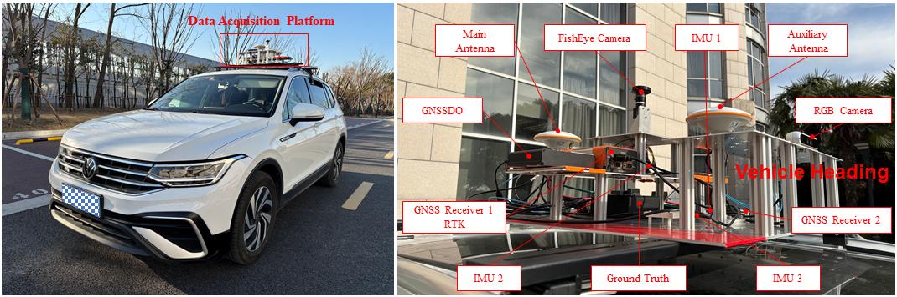

# SensNav 数据集

 SensNav数据集，共包含6条数据序列，其中五条是校园场景，一条是城市场景。城市场景数据长度为 18.6 公里，其中包含一条轨5.2公里的隧道数据。校园数据集开阔天空区域、林荫大道、建筑物遮挡等场景。
 
 传感器包括：一个RGB前视相机、一个指向天空的鱼眼相机、三个IMU、两个GNSS接收机和一个高精度GNSS/INS组合导航系统（提供Ground Truth）。

 

  

## 1 数据集说明

### 1.1 数据采集平台介绍

SensNav数据集由一个自行设计的多传感器数据采集平台收集得到，该平台由铝板铝材结构框架构成，传感器通过螺丝或者粘胶固定在框架上。框架通过行李架安装在采集车辆的车顶，数据收集车辆为大众Tiguan L。下图展示了采集车辆和传感器平台的说明。

  

整个框架分为三层。首先，最底层配备两个IMU、两个GNSS天线、一个高精度GNSS/INS组合导航系统（后简称Ground Truth）和一个GNSS接收器；其次，中间层配备一个IMU、一个GNSS同步时钟(GNSS disciplined oscillator, GNSSDO)和一个RGB相机；最后，顶层配备一个鱼眼相机。我们把Ground Truth的IMU中心设为框架的中心，其他传感器的排列与该中心的X、Y和Z轴保持对齐。下图显示了CAD制图的细节，包括一些关键尺寸和传感器坐标系信息。

  

上图中，我们只提供了最底层的俯视图和包括所有层的侧视图。因为中间层的IMU2的中心与Ground Truth的中心垂直对齐，只有Z轴坐标不同。在侧视图中，IMU1的被省略，因为它与Ground Truth的X轴重叠，会遮挡Ground Truth。此外，为了简化与美观，还去掉了一些不必要的安装孔。

### 1.2 传感器信息
SensNav对应的数据采集平台集成了一个RGB相机、一个鱼眼相机、三个IMU、两个GNSS接收机和一个高精度GNSS/INS组合导航系统（Ground Truth）。下面的表格列出了这些传感器的规格与部分参数：
|                                                                                                     Sensor                                                                                                    |                Type                |                                                              Key parameters                                                             | Frequency in ROS |
|:-------------------------------------------------------------------------------------------------------------------------------------------------------------------------------------------------------------:|:----------------------------------:|:---------------------------------------------------------------------------------------------------------------------------------------:|:----------------:|
|                                                                                             Forward-facing Camera                                                                                             | Intel RealSense Depth Camera D455f |                           RGB, 1280 x 720 H-FOV:90&deg;, V-FOV:65&deg;, D-FOV:98&deg;                          |       30 Hz      |
|                                                                                                Fish-eye Camera                                                                                                |       Hikrobot  MV-CS050-10UC      | RGB: 2448 x 2048 Sensor: 2/3'' Sony IMX264 CMOS Lens: Fujifilm FE185C057HA-1,1.8mm, H-FOV:185&deg;, V-FOV:185&deg; |       10 Hz      |
|                                                                                             GNSS receiver 1 (RTK)                                                                                             |   Septentrio OEM  AsteRx-m3 Pro+   |                                             GPS, GLONASS, BeiDou, Galileo, QZSS, NavIC, SBAS                                            |       20 Hz      |
|                                                                                                GNSS receiver 2                                                                                                |           u-blox ZED-F9P           |                                                   GPS, GLONASS, Galileo, BeiDou, QZSS                                                   |       10 Hz      |
|                                                                                         Ground Truth  GNSS/INS System                                                                                         |           CHCNAV CGI-830           |          BeiDou, GPS, GLONASS, Galileo, QZSS RTK Positioning Accuracy (RMS): 1 cm + 1 ppm (Horizontal), 2 cm + 1 ppm (Altitude)         |         -        |
|                                                                                                     IMU 1                                                                                                     |            WHEELTEC N100           |                                   Bias instability (Allan):  10&deg; /h (Gyro), 0.4 mg (Accel).                                   |      100 Hz      |
|                                                                                                     IMU 2                                                                                                     |            Xsens MTi 680           |                                    Bias instability (Allan): 8&deg; /h (Gyro), 0.01 mg (Accel).                                   |      200 Hz      |
|                                                                                                     IMU 3                                                                                                     |           HiPNUC  HI14R5N          |                                  Bias instability (Allan): 1.76&deg; /h (Gyro), 0.021 mg (Accel).                                 |      250 Hz      |

Note: FOV denotes field of view, with H-FOV, V-FOV, and D-FOV representing horizontal, vertical, and diagonal fields of view, respectively. Gyro and Accel are abbreviations for gyroscope and accelerometer.

**关于传感器的补充说明：**

**1) GNSS接收机.** GNSS接收机1和Ground Truth都接入了RTK，GNSS接收机2没有接RTK。三个GNSS设备通过功分器共用一个主天线。此外，GNSS接收机1和Ground Truth通过另一个功分器连接到辅助天线，从而实现定位定向。

**2) IMU.** IMU2和IMU3这两个IMU的X轴（前向）与底板中心对齐，即与Ground Truth的Y轴（前向）重合。IMU1安装在底板一侧，与Ground Truth的X轴（右向）对齐。具体尺寸可以参考CAD图。

**3) Ground Truth.** Ground Truth为上海华测导航技术股份有限公司（CHCNAV）的型号为CGI-830的高端MEMS组合导航接收机。CGI-830 具有一个全频GNSS模块和一个零偏不稳定性为0.2°/h的6轴高性能MEMS IMU。它支持使用NovAtel的Inertial Explorer软件进行紧耦合后处理。根据官方网站上的设备描述信息 [技术参数 TECHNICAL PARAMETER](https://obs-web.huace.cn/CHC%C2%AE+CGI-830%E5%8E%98%E7%B1%B3%E7%BA%A7%E7%BB%84%E5%90%88%E5%AF%BC%E8%88%AA%E7%B3%BB%E7%BB%9F%E7%94%A8%E6%88%B7%E6%89%8B%E5%86%8C-V2.2.3-20250110.pdf)，RTK模式下后处理的组合性能指标（RMS）：水平方向为0.01米，垂直方向为0.02米。此外，GNSS中断失锁60秒的情况下，后处理定位精度（RMS）也能达到水平 0.1 米和垂直 0.05 米。

### 1.3 同步
为保证时间上的一致性，使用ROS完成传感器数据采集。具有NTP同步功能的GNSSDO与主GNSS天线相连，并通过网线与数据采集主机相连。因此，数据采集主机系统时间与UTC同步，从而实现了ROS时间与UTC的粗对齐。两个GNSS接收机在ROS topic中都包含GPS周秒时间戳，可用于确定ROS时间戳与GPS时间之间的偏移。

### 1.4 标定
在IMU标定方面，我们在静态条件下收集了三个小时的数据，并使用开源工具箱 *imu_utils* （[链接](https://github.com/gaowenliang/imu_utils)）估算了陀螺仪和加速度计的噪声参数。

相机标定使用*Kalibr*工具箱（[链接](https://github.com/ethz-asl/kalibr)），来估计两台相机的内参，RGB相机使用*pinhole-radtan* 模型进行标定，而鱼眼相机则使用*omni-radtan* 模型进行标定。

在对每个IMU和相机进行单独的标定后，使用先前估算的IMU参数对RGB相机和三个IMU进行联合标定。同样使用*Kalibr*工具箱（[链接](https://github.com/ethz-asl/kalibr)）进行标定，得到RGB相机和三个IMU之间的外参矩阵。

## 2 数据概览与下载

### 2.1 数据序列信息汇总
|     **序列名称**    | **文件大小** |     **UTC时间**    |     **时长**    | **路径长度** |                                             **传感器**                                             |       **描述**      |
|:-------------------:|:------------:|:------------------:|:---------------:|:------------:|:--------------------------------------------------------------------------------------------------:|:-------------------:|
| 2025-01-15-14-25-49 |     10.9 GB     | 06:25:49- 06:44:27 | 1118s (18m:38s) |   5401.6 m   | IMU1, IMU2, IMU3, GNSS Receiver 1(RTK), GNSS Receiver 2, RGB camera, Fisheye camera, Ground Truth |      校园/下午      |
| 2025-01-15-15-00-35 |     7.6 GB     | 07:00:35- 07:15:05 |  870s (14m:30s) |   3869.94 m  | IMU1, IMU2, IMU3, GNSS Receiver 1(RTK), GNSS Receiver 2, RGB camera, Fisheye camera, Ground Truth |      校园/下午      |
| 2025-01-15-17-01-24 |     569.1 MB     | 09:01:24- 09:39:06 | 2261s (37m:41s) |   18.62 km   |                   IMU1, IMU2, GNSS Receiver 1(RTK), GNSS Receiver 2, Ground Truth                  | 城区（含隧道）/傍晚 |
| 2025-01-15-19-17-15 |     5.6 GB     | 11:17:15- 11:33:57 | 1001s (16m:41s) |   4683.97 m  | IMU1, IMU2, IMU3, GNSS Receiver 1(RTK), GNSS Receiver 2, RGB camera, Fisheye camera, Ground Truth |      校园/晚上      |
| 2025-01-17-15-54-34 |     8.3 GB     |  07:54:34-08:08:58 |  863s (14m:23s) |   3865.18 m  | IMU1, IMU2, IMU3, GNSS Receiver 1(RTK), GNSS Receiver 2, RGB camera, Fisheye camera, Ground Truth |      校园/下午      |
| 2025-01-17-18-00-01 |     6.0 GB     |  10:00:01-10:18:24 | 1103s (18m:23s) |   5516.12 m  | IMU1, IMU2, IMU3, GNSS Receiver 1(RTK), GNSS Receiver 2, RGB camera, Fisheye camera, Ground Truth |      校园/晚上      |

### 2.2 下载
**链接：**

- 2025-01-15-14-25-49: [夸克网盘](https://pan.quark.cn/s/18e764b10ab2)

- 2025-01-15-15-00-35: [夸克网盘](https://pan.quark.cn/s/99c057df934c)

- 2025-01-15-17-01-24: [夸克网盘](https://pan.quark.cn/s/e024b31f3767)

- 2025-01-15-19-17-15: [夸克网盘](https://pan.quark.cn/s/8f600a2a10e9)

- 2025-01-17-15-54-34: [夸克网盘](https://pan.quark.cn/s/9810889e2788)

- 2025-01-17-18-00-01: [夸克网盘](https://pan.quark.cn/s/afce9da2ef75)

## 3 文件说明
### 3.1 数据集文件结构与说明
数据集中的文件结构如下图所示：

  

**1)** 名称中带有''ROS''标识符的`.bag`文件，是在ROS下收集的数据，包括来自IMU、相机和GNSS接收机的数据。具体topic名称上图所示，其中蓝色背景代表IMU相关的topic，黄色背景对应相机相关的topic，绿色背景表示GNSS接收机相关的topic。此外，*/INTELcam/imu* 指的是INTEL相机内置IMU的数据，也包含在数据集中。**注意**：城市序列数据文件夹''2025-01-15-17-01-24''中的包文件不包含任何与相机和IMU1相关的topic。

**2)** 名称中带有''GNSS1''标识符的`.sbf`和`.25O`文件，是由GNSS接收机1内部记录的原始数据文件。对应两种不同的数据格式：二进制SBF（Septentrio二进制格式）文件、RINEX格式文件。其中，RINEX格式的文件由Septentrio的官方''SBF Converter''软件转换生成。如有其他格式需求，可以去Septentrio官网自行下载''RxTools''软件（[Septentrio官网链接](https://www.septentrio.com/en/products/gps-gnss-receiver-software/rxtools#resources)），其中包含了''SBF Converter''，然后可以对''.sbf''文件进行转换。

**3)** 名称中带有''Correction''标识符的`.25o`文件，是以RINEX格式存储的RTK基准站数据，该RINEX文件的时间段覆盖ROS中保存数据的时段。

**4)** 名称中带有''GT''标识符的`.txt`文件，是使用NovAtel的Inertial Explorer软件进行紧耦合后处理得到的结果，被用来作为Ground Truth。文件名后的数字后缀（1Hz、10Hz、20Hz）表示数据采样率，提供多种速率以满足不同的应用需求。为了方便查看Ground Truth轨迹，我们额外提供了Ground Truth 1Hz版本的KML文件，放在了''GT-1Hz-KML''文件夹中。

**5)** IMU 和相机的标定结果文件存储在单独的''Calibration''文件夹中。此外，三个IMU以及Ground Truth到GNSS主天线之间的杆臂值放置在 `Lever Arms.txt`文件中。

**6)** 关于两个GNSS接收机对应的topic中的message格式，可以参考：ublox ROS驱动（[ublox ROS driver](https://github.com/KumarRobotics/ublox)），ublox消息格式（[ublox message](https://docs.ros.org/en/kinetic/api/ublox_msgs/html/index-msg.html)），Septentrio ROS驱动（[Septentrio ROS driver](https://github.com/septentrio-gnss/septentrio_gnss_driver)）。

### 3.2 Ground Truth轨迹展示（使用谷歌地球绘图）
下面展示了所有数据序列的Ground Truth轨迹，该轨迹使用''GT-1Hz-KML''文件夹中的kml用谷歌地球绘制。
- **2025-01-15-14-25-49:**

  

- **2025-01-15-15-00-35:**

  

- **2025-01-15-17-01-24:**

  

- **2025-01-15-19-17-15:**

  

- **2025-01-17-15-54-34:**

  

- **2025-01-17-18-00-01:**

  

## 4 引用
如果我们的数据集对你有所帮助，并且将它用在公开发表的论文或学术研究中，请引用我们的论文：
https://ieeexplore.ieee.org/abstract/document/11048645

~~~
@ARTICLE{11048645,
  author={Gao, Xuyu and Yang, Yuting and He, Di and Ma, Ziwei and Yu, Wenxian and Yang, Ke},
  journal={IEEE Transactions on Instrumentation and Measurement}, 
  title={SensNav: A Multisensor Vehicle Navigation Dataset for Campus and Urban Environments With a Long Tunnel}, 
  year={2025},
  volume={74},
  number={},
  pages={1-12},
  keywords={Global navigation satellite system;Cameras;Navigation;Location awareness;Autonomous vehicles;Sensors;Trajectory;Laser radar;Synchronization;Heuristic algorithms;Campus and urban environments;fisheye imagery;multisensor fusion;raw global navigation satellite system (GNSS) measurements;SensNav dataset;tunnel navigation},
  doi={10.1109/TIM.2025.3582308}}

~~~

